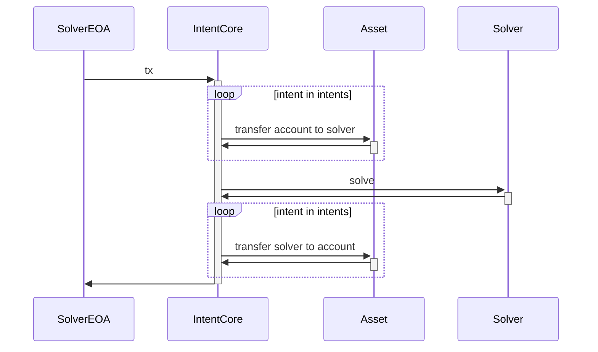

# Intent Core

a reasonably optimized, minimalist intent engine

execution trace:



data type:

```solidity
struct Intent {
    address account;
    address inAsset;
    address outAsset;
    uint256 inMax;
    uint256 outMin;
    uint64 deadline;
    uint8 v;
    bytes32 r;
    bytes32 s;
}
```

signature hash:

```solidity
bytes32 hash = keccak256(
    abi.encode(
        nonce,
        intent.inAsset,
        intent.outAsset,
        intent.inMax,
        intent.outMin,
        tntent.deadline
    )
);
```
